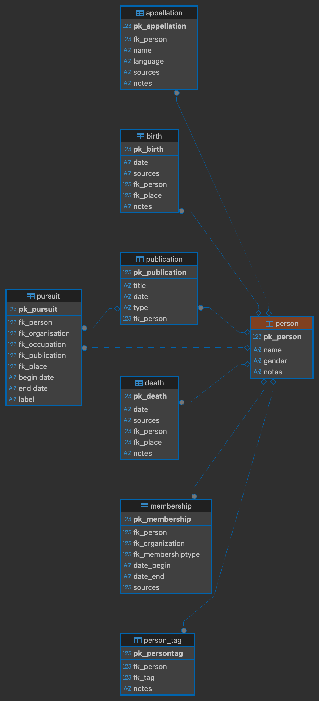

# Etude prosopographique de la population des correspondants de guerre

## Présentation du projet
Le présent dossier a été réalisé dans le cadre du cours ""From Information to data: introduction to research information systems for historical and social sciences" donné par Francesco Beretta à l'UNIFR pendant le semestre d'automne 2025". 
Il s'agissait de transformer des données non-structurées et semi-structurées issues du web sémantique en une base de données relationnelle, afin de répondre à une problématique issue de la méthodologie prosopographique. Ainsi, la base de données créée a été pensée afin de questionner la structure de la population des "correspondants de guerre".

## Sources
Le choix de la population s'est fait à travers l'extraction de listes Wikipedia et DBpédia, dont les entrées correspondaient à la catégorie "correspondant de guerre".

## Etapes de réalisation: 
1. Identification de la population cible via le web sémantique (DBpédia).
2. Création d'un modèle conceptuel de données (MCD) afin de définir les objets. 
3. Transformation du MCD en un schéma relationnel avec des tables, contenant des clés primaires et des clés secondaires.
4. Extraction des données issues du web sémantique. 
5. Nettoyage et structuration des données extraites en format CVS.
6. Implémentation de la base relationnelle, permettant la création de views relationnelles, dont les résultats peuvent s'exporter.

## Schéma relationnel de la base de données

 

## Table des matières
 
* __[table of contents](documentation/home.md)__ 
